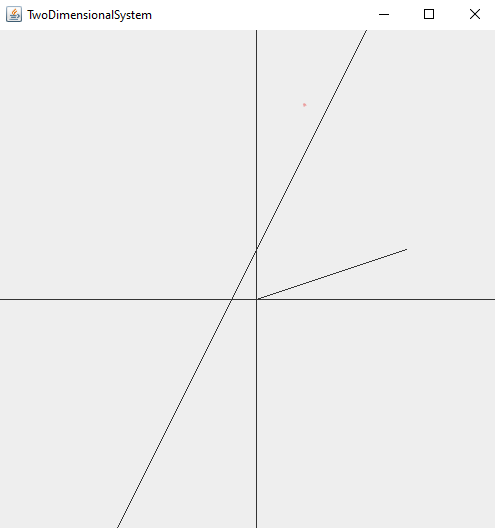
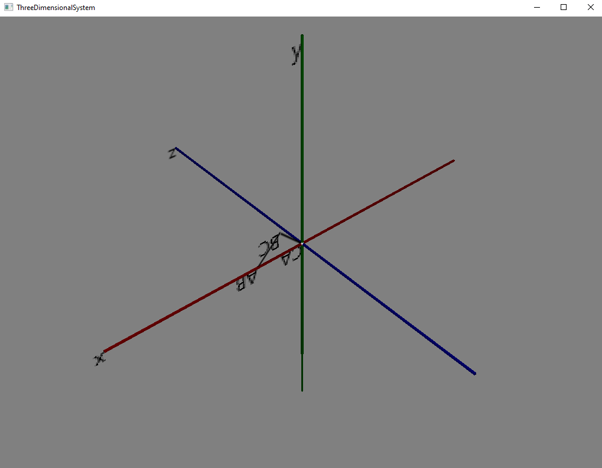

<h1>How to run the code</h1>

Clone the repository to a directory on your machine

Execute the code from main.java or ThreeDimensionSystem.java

The application should now be running

<h1>What I have learned</h1>
<ul>

<li>Applying linear algebra rules</li>
<li>Visualization of vectors and cartesian coordinate system</li>
<li>Creating a javaFX application with fxml</li>
<li>Expanding my Java knowledge</li>
<li>JUnit testing</li>
</ul>
<h1>Description</h1>

I created this project while listening to my linear algebra 
lecture to apply the theory directly.

This projects only purpose was to visualize and apply linear 
rules.

